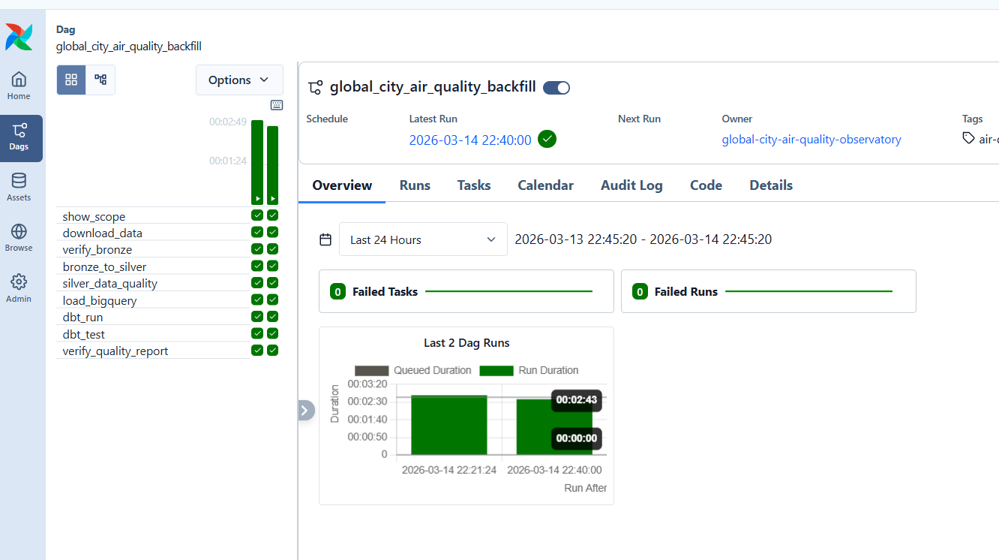
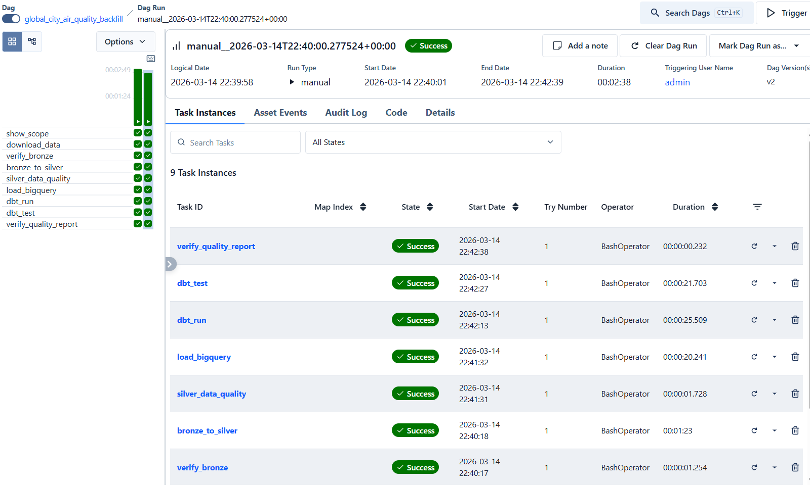
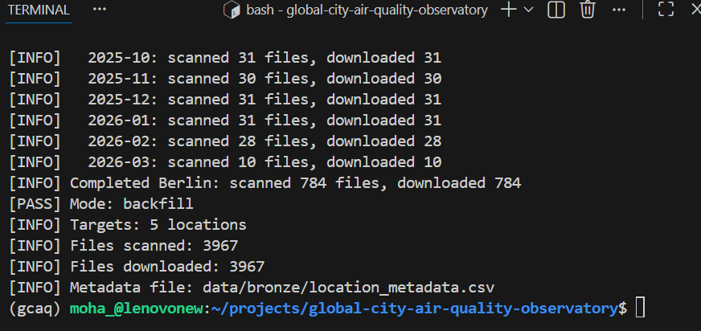
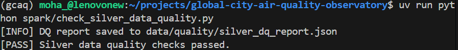
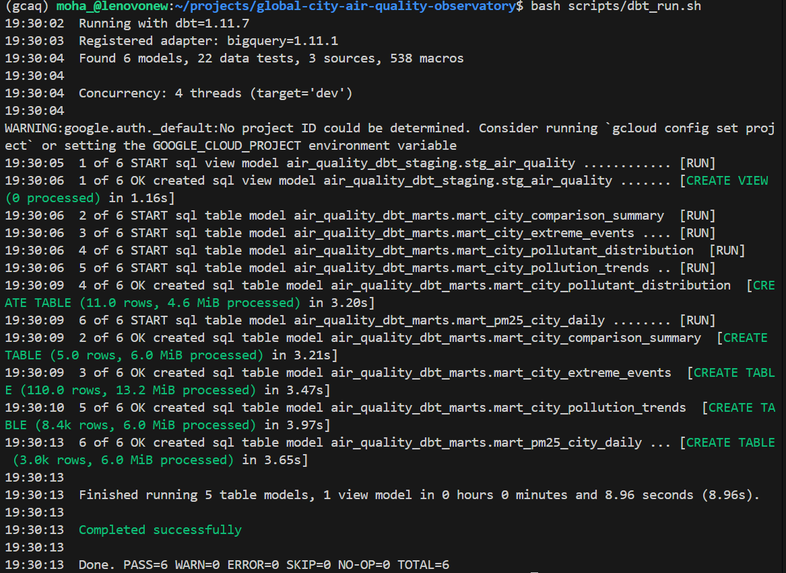
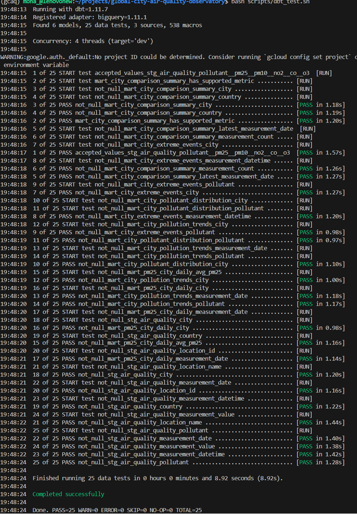
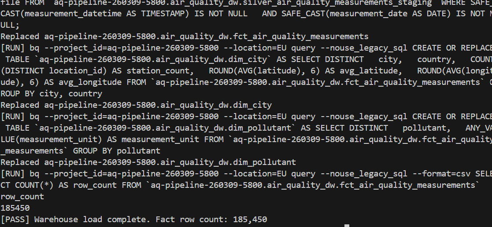
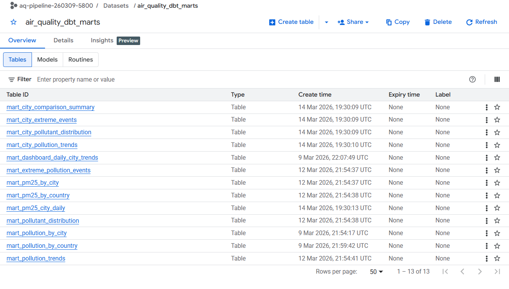
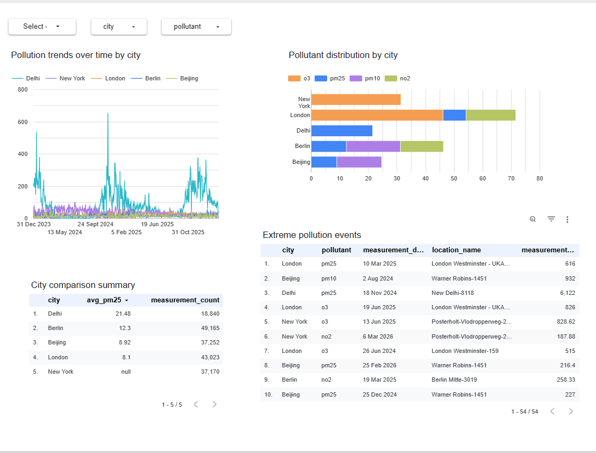

# Execution evidence

This document provides proof that the Global City Air Quality Observatory pipeline ran successfully across orchestration, transformation, warehouse loading, and visualization layers.

All proof-of-run assets referenced below are committed in `docs/images/`.

Committed evidence files used in this document:

- `airflow_dag_graph.png`
- `airflow_success_run.png`
- `bronze_ingestion_success.png`
- `silver_quality_report.png`
- `dbt_run_output.png`
- `dbt_test_output.png`
- `load_to_bigquery.png`
- `bigquery_tables.png`
- `dashboard_overview.png`
- `Global_City_Air_Quality_Observatory_Dashboard.pdf`

## Airflow

### DAG structure

### Successful DAG run

## Bronze and Silver validation

The pipeline lands raw OpenAQ data in the Bronze layer, transforms it into curated Silver parquet datasets, and validates data quality before warehouse loading.

### Bronze ingestion success

### Silver quality report

## dbt

### dbt run output

### dbt test output

## BigQuery

The warehouse and analytical marts are materialized in BigQuery. Cloud-side evidence is already captured below through the load and table screenshots committed in `docs/images/`.

### BigQuery load output

### BigQuery tables

## Dashboard

The final dashboard presents a five-city comparison of pollution trends and pollutant patterns.

### Dashboard overview

### Dashboard export
[Global City Air Quality Observatory dashboard PDF](images/Global_City_Air_Quality_Observatory_Dashboard.pdf)

### Live dashboard
[Global City Air Quality Observatory Looker Studio dashboard](https://lookerstudio.google.com/reporting/6432e2e1-4363-493c-bbf8-598c60bb49de)
